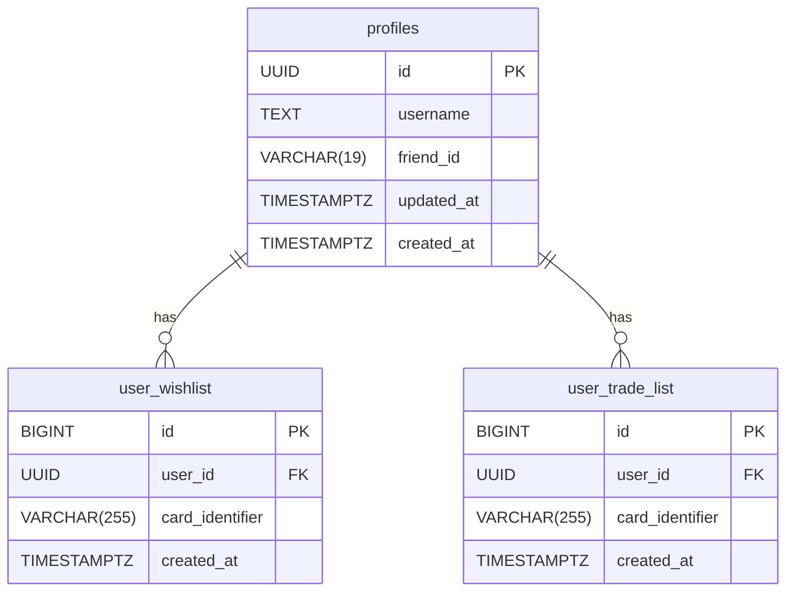

## Technical Design Document: Pokémon TCG Pocket Matchmaker

### 1. High-Level Overview

This document outlines the technical design for a web application, the "Pokémon TCG Pocket Matchmaker." The primary goal of this application is to connect players of the Pokémon TCG Pocket game by allowing them to list cards they are looking for (Wishlist) and cards they are willing to trade (Trade List), and then find potential trading partners.

The design is optimized for performance and cost-effectiveness, intended for hosting on Vercel's free tier. It achieves this by shifting the primary data-fetching load from the backend to the client, leveraging browser caching, and minimizing serverless function executions.

#### 1.1. Core Features

- **User Accounts:** Users can sign up with a username, password, and their official TCG Pocket Friend ID.
- **Client-Side Card Data Management:** The app fetches all Pokémon TCG Pocket card data directly in the browser and caches it locally for 24 hours to ensure speed and minimize external requests.
- **Wishlist & Trade List Management:** Users can manage their lists via a unified, tabbed interface that allows for rapid selection/deselection of cards.
- **Card Browser:** A single, efficient interface with client-side searching and filtering for managing both Wishlist and Trade List.
- **Matchmaking:** The system identifies potential trades by finding users whose Wishlist items match another user's Trade List items, respecting trade-specific rules.

#### 1.2. Technology Stack

- **Frontend Framework:** **Next.js (React)** - Chosen for its static generation capabilities, routing, and component-based architecture.
- **Styling:** **Tailwind CSS** - A utility-first CSS framework for rapid and consistent UI development.
- **Backend:** **Next.js API Routes** - Serverless functions hosted by Vercel to handle authentication and database interactions.
- **Database:** **Supabase (PostgreSQL)** - A Backend-as-a-Service platform providing a managed database, authentication, and security policies.
- **Data Fetching (Client):** A custom React hook using `fetch` with `localStorage` for efficient caching of public card data.
- **Authentication:** **Supabase Auth** - Provides secure, built-in handling of user sign-ups, logins, and session management via JWTs.

### 2. Vercel Free Tier Optimization Strategy

To maximize the use of Vercel's free tier, the following strategies will be employed:

1.  **Client-Side Data Fetching:** The browser will fetch the `cards.json`, `sets.json`, and `rarity.json` directly from the GitHub source. This completely eliminates serverless function invocations for card data retrieval.
2.  **Browser Caching:** The fetched JSON data will be stored in the browser's `localStorage` with a timestamp. Logic will be implemented to only re-fetch the data from GitHub if the cached data is more than 24 hours old.
3.  **Static Site Generation (SSG):** Pages that do not require authentication, such as the Landing/Login page (`/`), will be statically generated at build time. These pages are served directly from Vercel's Edge Network (CDN), which is fast and does not consume function execution resources.
4.  **Client-Side Rendering (CSR) for Authenticated Pages:** Pages requiring a user session (e.g., `/dashboard`, `/cards`) will be rendered as static shells. Upon loading, they will use a React hook to fetch user-specific data from the API, avoiding resource-intensive Server-Side Rendering.
5.  **Batching API Updates:** In the card management UI, a single "Save Changes" action will send a batch of required updates to the backend, consolidating multiple potential API calls into one or two.

### 3. System Architecture

The architecture is client-centric. The Vercel backend's role is strictly limited to authentication and user data management.

```mermaid
graph TD
    subgraph User's Device
        A[Client/Browser]
        A_Cache[LocalStorage Cache]
    end

    subgraph Vercel Platform
        B[Next.js Frontend (Static Shells)]
        C[Next.js API Routes (Auth/DB only)]
    end

    subgraph Supabase Cloud
        D[Supabase Auth]
        E[PostgreSQL Database]
    end

    subgraph External Data (GitHub)
        F[cards.json, sets.json, rarity.json]
        G[images/*]
    end

    A -- HTTP Requests --> B
    A -- Checks/Reads --> A_Cache
    A_Cache -- If Stale/Empty --> A
    A -- Fetches Card Data --> F
    A -- Fetches Images --> G
    A -- API Calls (Login, Save Lists) --> C

    B -- Renders HTML/JS/CSS --> A
    C -- DB Queries --> E
    C -- Auth Checks --> D
    D -- Manages Users --> E
```

**Flow Description:**

1.  A user's browser loads a statically generated page shell from Vercel's Edge Network.
2.  The client-side JavaScript checks `localStorage` for cached Pokémon data.
3.  If the cache is empty or older than 24 hours, the browser fetches `cards.json` directly from GitHub and updates the cache. Otherwise, it uses the cached data.
4.  For authenticated actions, the client makes API calls to the Next.js API Routes (e.g., login, save lists).
5.  The API Routes exclusively handle business logic involving the user database on Supabase.

### 4. Database Design

The database will be hosted on Supabase (PostgreSQL). The schema is designed to be simple, relational, and secure.

#### 4.1. Data Model & Schema

We will have three primary tables: `profiles`, `user_wishlist`, and `user_trade_list`.

**Table 1: `profiles`**

| Column Name  | Data Type     | Constraints                                 | Description                                                            |
| :----------- | :------------ | :------------------------------------------ | :--------------------------------------------------------------------- |
| `id`         | `UUID`        | Primary Key, Foreign Key to `auth.users.id` | The unique identifier for the user, from the auth service.             |
| `username`   | `TEXT`        | `UNIQUE`, `NOT NULL`                        | The user's chosen display name.                                        |
| `friend_id`  | `VARCHAR(19)` | `UNIQUE`, `NOT NULL`                        | The user's Pokémon TCG Pocket Friend ID (e.g., `1234-1234-1234-1234`). |
| `updated_at` | `TIMESTAMPTZ` | `NOT NULL`, Default `NOW()`                 | Timestamp of the last profile update.                                  |
| `created_at` | `TIMESTAMPTZ` | `NOT NULL`, Default `NOW()`                 | Timestamp of profile creation.                                         |

**Table 2: `user_wishlist`**

| Column Name       | Data Type      | Constraints                  | Description                                          |
| :---------------- | :------------- | :--------------------------- | :--------------------------------------------------- |
| `id`              | `BIGINT`       | Primary Key, Identity        | A unique identifier for the wishlist entry.          |
| `user_id`         | `UUID`         | Foreign Key to `profiles.id` | The user who owns this wishlist item.                |
| `card_identifier` | `VARCHAR(255)` | `NOT NULL`                   | A unique string identifying the card (e.g., `A1-1`). |
| `created_at`      | `TIMESTAMPTZ`  | `NOT NULL`, Default `NOW()`  | Timestamp of when the card was added.                |

**Table 3: `user_trade_list`**

| Column Name       | Data Type      | Constraints                  | Description                                          |
| :---------------- | :------------- | :--------------------------- | :--------------------------------------------------- |
| `id`              | `BIGINT`       | Primary Key, Identity        | A unique identifier for the trade list entry.        |
| `user_id`         | `UUID`         | Foreign Key to `profiles.id` | The user who owns this trade list item.              |
| `card_identifier` | `VARCHAR(255)` | `NOT NULL`                   | A unique string identifying the card (e.g., `A1-1`). |
| `created_at`      | `TIMESTAMPTZ`  | `NOT NULL`, Default `NOW()`  | Timestamp of when the card was added.                |

**Note on `card_identifier`:** We will not store the full Pokémon card data in our database. The `card_identifier` will be a composite key constructed from the JSON data, like `{{set}}-{{number}}`.

#### 4.2. Relationships



### 5. Backend (API Routes) Design

All backend logic will be handled via Next.js API routes. Their surface area is minimized to reduce serverless function usage.

#### 5.1. Authentication Endpoints (`/api/auth/`)

- **`POST /api/auth/signup`**: Handles new user registration.
- **`POST /api/auth/login`**: Authenticates an existing user.
- **`POST /api/auth/logout`**: Clears the user's session.

#### 5.2. User Data Endpoints (`/api/user/`)

- **`GET /api/user/me`**: Retrieves the currently logged-in user's profile, wishlist, and tradelist identifiers.
- **`POST /api/user/wishlist/batch-update`**:
  - **Body:** `{ toAdd: string[], toRemove: string[] }`
  - **Action:** Performs bulk `INSERT` and `DELETE` operations for the user's wishlist in a single transaction.
- **`POST /api/user/tradelist/batch-update`**:
  - **Body:** `{ toAdd: string[], toRemove: string[] }`
  - **Action:** Performs bulk `INSERT` and `DELETE` operations for the user's trade list in a single transaction.

#### 5.3. Matchmaking Endpoint (`/api/matches`)

- **`GET /api/matches`**:
  - **Action:** Executes the core matchmaking logic. This serverless function will fetch its own copy of `cards.json` (and cache it in memory with a TTL) to perform the required rarity-matching logic between users' lists without relying on the client.

### 6. User Interface (UI) Design

The UI will be clean, responsive, and mobile-first, built with React and Tailwind CSS.

#### 6.1. Pages/Screens

1.  **Landing/Login Page (`/`)**: A static page with forms for login and signup.
2.  **Dashboard (`/dashboard`)**: The main authenticated landing page. It displays a summary of the user's currently saved Wishlist and Trade List, along with a list of potential matches.
3.  **Card Management Page (`/cards`)**: A single, dynamic page for managing both lists.
    - **Layout & Interaction:**
      1.  **Tabs:** Two prominent tabs: "Wishlist" and "Trade List". Clicking a tab switches the context of the card grid below.
      2.  **Controls:** A search bar and rarity filters allow users to quickly find cards. All filtering logic is handled client-side.
      3.  **Card Grid:** A responsive, scrollable grid displays all cards. A card's appearance changes based on whether it is selected in the currently active list.
          - Selected cards are rendered in full color.
          - Unselected cards are greyed out.
      4.  **Toggling Logic:** Clicking a card toggles its selection status for the active list.
          - **Trade List Rule:** If the "Trade List" tab is active, users are prevented from selecting cards with rarities other than Common, Uncommon, Rare, Double Rare, and Art Rare. An unobtrusive message will inform the user of this rule.
      5.  **Saving Changes:** A "Save Changes" bar appears when the user's selections differ from their last saved state. Clicking "Save" triggers the batch update API calls.

4.  **Matches Page (`/matches`)**: Displays a detailed list of potential trades, showing the user's offer, the partner's offer, and the partner's username and Friend ID.

#### 6.2. Key Components

- **`Navbar`**: Displays navigation links and user status (logged in/out).
- **`Card`**: A reusable component to display a card's image, name, and rarity. Its props (`isSelected`, `isDisabled`) control its visual state (full color, greyed out, non-selectable).
- **`CardGrid`**: Renders the grid of `Card` components, responding to search and filter criteria.
- **`TabNavigation`**: A component with two buttons that controls which list ("Wishlist" or "Trade List") is currently being edited.
- **`SaveChangesBar`**: A conditionally rendered component with "Save Changes" and "Discard Changes" buttons, visible only when there are unsaved modifications.

### 7. Security Model

Security is addressed at multiple layers to protect user data and ensure application integrity.

1.  **Authentication:** Handled by **Supabase Auth**, which implements industry-standard password hashing and salting. Sessions are managed using JSON Web Tokens (JWTs) stored in **secure, httpOnly cookies**, preventing XSS attacks from accessing them.
2.  **Authorization:** All API routes handling user data are protected and require a valid JWT. **Row Level Security (RLS)** is enabled on all user-data tables in Supabase, ensuring that a user can only ever access or modify their own data at the database level.
3.  **API Rate Limiting:** To prevent brute-force attacks, credential stuffing, and denial-of-service, all sensitive API endpoints (especially `/api/auth/*`) will be protected by rate-limiting. An IP-based, in-memory store will be used to restrict the number of requests from a single IP address within a given time window.
4.  **Cross-Site Request Forgery (CSRF) Protection:** To protect against CSRF attacks, the application will implement the "Double Submit Cookie" pattern. A middleware will generate a CSRF token, set it in a cookie, and also provide it in a custom header or request body. On subsequent state-changing requests, the server will verify that the token from the cookie matches the one sent in the request.
5.  **Data Transmission:** The application is served exclusively over **HTTPS**, encrypting all data in transit between the client and server.
6.  **Input Validation & Sanitization:** All user input (e.g., usernames, friend IDs) is validated on both the client and server-side to prevent malicious input. Crucially, user-supplied strings like `username` will be sanitized on the server before being stored to strip any potential HTML or script tags, mitigating the risk of Stored Cross-Site Scripting (XSS).
7.  **Secure Error Handling:** API endpoints will return generic error messages for failed authentication or authorization attempts (e.g., "Invalid credentials" instead of "User not found") to prevent user enumeration and information disclosure.
8.  **Dependencies:** Application dependencies are regularly monitored for vulnerabilities using standard toolchains like `npm audit`.
